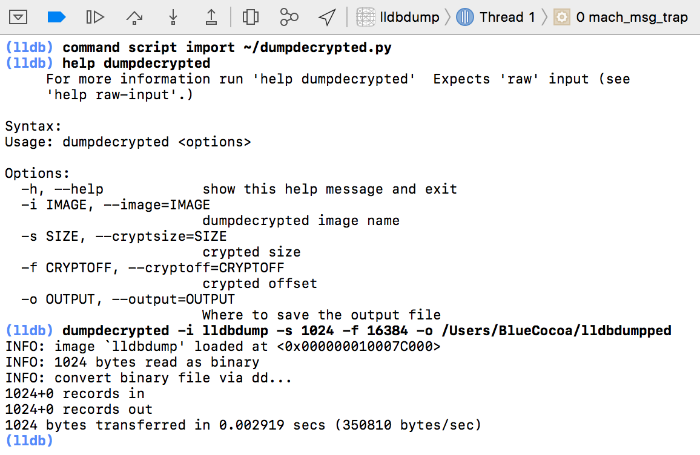

# dumpdecrypted-lldb

Dump the decrypted binary file in LLDB

For details, you may refer to my blog, [dumpdecrypted in LLDB](https://blog.0xbbc.com/2017/08/dumpdecrypted-in-lldb/)

### Usage

For example,
```
command script import /PATH/TO/THE/dumpdecrypted.py
dumpdecrypted -i Ingress -s 30097408 -f 16384 -o /Users/BlueCocoa/Ingress_dumpdecrypted
```

If in doubt, 

```
help dumpdecrypted
```

### Screenshot


